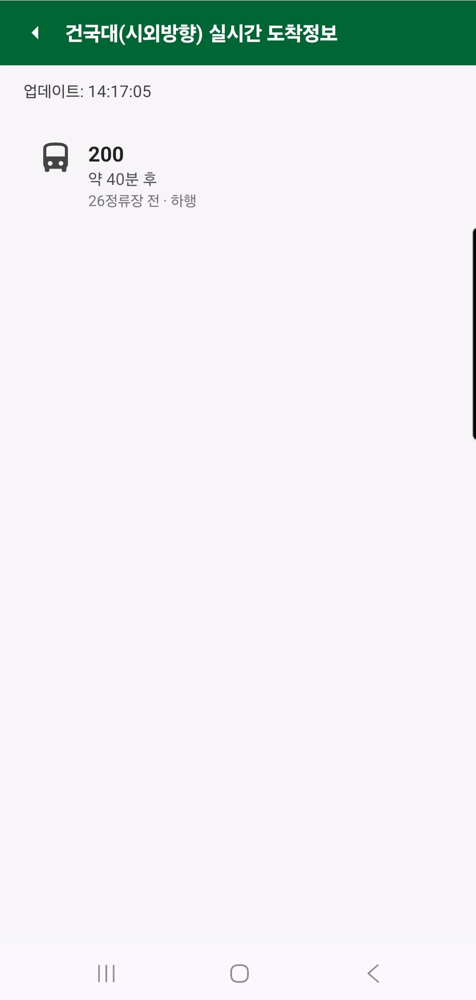
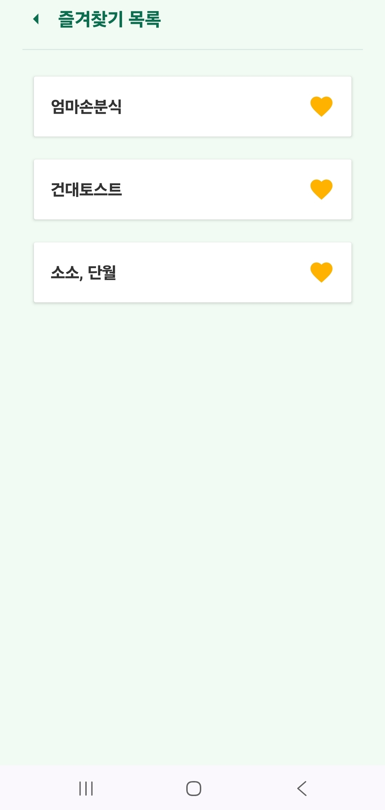

# 🚀 건대 어때 (KU Bus & Facility App)

<h3 align="center"><b>건국대학교 글로컬 캠퍼스 학생을 위한 버스 · 편의시설 · 즐겨찾기 통합 앱</b></h3>

------------------------------------------------------------------------

# 🎯 오픈 미션 개요

이번 프로젝트는 **우아한테크코스 프리코스 오픈미션**의 일환으로 진행되었습니다.  
프리코스 과정에서 학습한 문제 해결 방식, 책임 분리, 테스트 중심 사고를 기반으로  
2주간 스스로 기획·설계·구현하는 **자율 프로젝트 챌린지**입니다.

------------------------------------------------------------------------

## 📚 목차

1.  프로젝트 소개
2.  주요 기능
3.  기술 스택
4.  아키텍처
5.  실행 방법
6.  폴더 구조
7.  개발 목적 & 학습 포인트

------------------------------------------------------------------------

# 🌟 프로젝트 소개

**건대 어때**는 건국대학교 글로컬 캠퍼스 학생들을 위한\
생활 밀착형 Android 애플리케이션입니다.

-   버스 도착 정보
-   주변 편의시설 탐색
-   즐겨찾기 관리

학생들의 실제 요구를 기반으로 설계된 실용 앱입니다.

------------------------------------------------------------------------

# 🔥 주요 기능

## 🚍 버스 도착 정보

-   **정류장 선택:** 건국대학교 주변 6개 주요 정류장 선택 기능 제공 (건국대 정문/후문, KU 스테이션 포함)

-   **데이터 연동:** 한국교통안전공단(TAGO) API를 이용한 실시간 도착 정보를 제공합니다.

-   **네트워킹: OkHttp** 라이브러리를 직접 사용하여 API를 호출하고 JSON 응답을 파싱하여 처리합니다.

-   **오류 처리:** API 통신 실패 시 (네트워크 오류, 서버 응답 오류 등) 사용자에게 명확한 **에러 메시지 UI**를 표시하고 재시도 기능을 제공하여 안정성을 확보했습니다.

-   **실시간 처리:** 도착 예정 시간을 기준으로 **자동 정렬**되며, 15초 주기로 타이머를 설정하여 화면 정보를 **자동 갱신**합니다.

-   **UI 구성: RecyclerView** 기반으로 버스 목록을 표시하며, 노선명, 도착 예정 시간(분), 잔여 정류장 수, 상행/하행 방향을 상세하게 보여줍니다.

------------------------------------------------------------------------

## 🍽️ 편의시설 카테고리 탐색

-   **세부 카테고리:** 한식, 중식, 일식/돈까스, 치킨/피자, 버거, 분식, 카페, 편의점 등 총 **8가지 카테고리**를 제공합니다.

-   **목록 데이터:** FacilityListActivity.kt 파일 내에 시설 정보가 하드코딩된 리스트 형태로 정의되어 있으며, 선택된 카테고리에 맞춰 필터링됩니다.

-   **즐겨찾기 연동:** 시설 목록 UI에서 바로 즐겨찾기 추가/삭제가 가능하며, 이 상태 변화는 Room DB에 반영됩니다.

------------------------------------------------------------------------

## ⭐ 즐겨찾기(Room)

-   **영구 저장: Room Persistence Library**를 사용하여 즐겨찾기 데이터(FavoriteEntity)를 로컬 SQLite 데이터베이스에 영구적으로 저장합니다.

-   **아키텍처: MVVM** 패턴을 적용하여 FavoriteViewModel, FavoriteRepository, FavoriteDao로 책임을 분리했습니다.

-   **비동기 처리:** 데이터베이스 CRUD 작업은 **Kotlin Coroutines**의 suspend 함수로 구현되었으며, 결과를 콜백 패턴으로 UI에 전달하여 안정적인 비동기 처리를 확보했습니다.

-   **화면:** FavoriteListActivity에서 즐겨찾기 목록을 확인하고 삭제할 수 있습니다.

------------------------------------------------------------------------

## 🧩 기술 스택

| 구분 | 기술 |
|------|------|
| **Language** | Kotlin |
| **UI** | ViewBinding, Material Components, RecyclerView |
| **Data** | Room Database, LiveData |
| **Architecture** | MVVM 일부 적용, Repository 패턴 |
| **Build** | Gradle Kotlin DSL |
| **Layout** | XML, Drawable |

------------------------------------------------------------------------

# 🧱 아키텍처

## Activity 구조

    MainActivity
    ├── BusCategoryActivity
    │     └── BusArrivalActivity
    ├── FacilityCategoryActivity
    │     └── FacilityListActivity
    └── FavoriteListActivity

## Room 구조

    FavoriteEntity
    FavoriteDao
    FavoriteRepository
    FavoriteViewModel

## 데이터 흐름

    Activity → ViewModel → Repository → DAO → Room DB
                        ↑ LiveData observe

## 책임 분리 (Separation of Concerns)

-   **Activity/View:** UI 렌더링 및 사용자 이벤트 처리 역할만 담당.

-   **ViewModel:** View와 Repository 사이의 데이터 중개자 역할. LiveData를 통해 UI에게 데이터의 변화를 알림.

-   **Repository:** 데이터 소스(Room DB, TAGO API)와의 통신을 담당하며, ViewModel에게 **순수한 데이터**를 제공하여 비즈니스 로직을 캡슐화.

------------------------------------------------------------------------

# 📱 실행 방법

## ▶ Android Studio

1.  Android Studio 실행
2.  File → Open → 프로젝트 선택
3.  에뮬레이터 또는 기기 연결
4.  Run ▶ 실행

------------------------------------------------------------------------

## ▶ CLI 실행

### Build

    ./gradlew assembleDebug

### Install

    adb install -r app/build/outputs/apk/debug/app-debug.apk

### Run

    adb shell am start -n com.konkuk.ottae/.MainActivity

### adb 확인

    adb devices

------------------------------------------------------------------------

# 📂 폴더 구조

    app/
    └── src/main/
        ├── java/com/konkuk/ottae/
        │    ├── bus/
        │    │  ├── BusAdapter.kt                   # 버스 리스트 RecyclerView 어댑터
        │    │  ├── BusArrivalActivity.kt           # 버스 도착 정보 표시 화면
        │    │  ├── BusCategoryActivity.kt          # 버스 정류장 선택 화면
        │    │  └── BusItem.kt                      # 버스 도착 정보 데이터 클래스
        │    │
        │    ├── facility/
        │    │  ├── Facility.kt                     # 편의시설 정보 데이터 클래스
        │    │  ├── FacilityAdapter.kt              # 편의시설 리스트 어댑터
        │    │  ├── FacilityCategoryActivity.kt     # 편의시설 카테고리 선택 화면
        │    │  └── FacilityListActivity.kt         # 편의시설 목록 화면
        │    │
        │    ├── favorite/
        │    │  ├── FavoriteDao.kt                  # DAO (Insert/Delete/Query)
        │    │  ├── FavoriteEntity.kt               # Room 엔티티
        │    │  ├── FavoriteListActivity.kt         # 즐겨찾기 화면
        │    │  ├── FavoriteListAdapter.kt          # 즐겨찾기 리스트 어댑터
        │    │  ├── FavoriteRepository.kt           # DB Repository
        │    │  ├── FavoriteViewModel.kt            # ViewModel (LiveData)
        │    │  └── FavoriteViewModelFactory.kt     # ViewModel 생성용 Factory 클래스
        │    │
        │    ├── AppDatabase.kt              # 앱 홈 화면 (버스/편의시설/즐겨찾기 진입)  
        │    └── MainActivity.kt             # Room Database 설정
        │
        ├── res/layout/
        ├── res/drawable/
        ├── res/values/
        └── AndroidManifest.xml

------------------------------------------------------------------------

# 📸 스크린샷

<table>
  <tr>
    <th align="center">🚍 버스 도착</th>
    <th align="center">🍽️ 편의시설 목록</th>
    <th align="center">⭐ 즐겨찾기</th>
  </tr>
  <tr>
    <td align="center"></td>
    <td align="center"></td>
    <td align="center"></td>
  </tr>
</table>

------------------------------------------------------------------------

# ⚙ 개발 목적 & 학습 포인트

-   Activity/Intent 구조 학습
-   외부 API 연동 및 네트워킹 처리 (OkHttp)
-   RecyclerView + Adapter 기반 리스트 UI
-   Room 기반 영구 데이터 저장
-   MVVM 일부 적용
-   Android Material Components 활용
-   실무 확장 가능 구조 설계

------------------------------------------------------------------------

# ✨ 오픈 미션에서 배운 점

- Kotlin Android라는 낯선 기술 스택을 빠르게 분석하고 프로젝트에 적용
- Room + ViewModel + Repository 구조를 직접 설계하며 MVVM 감각 확보
- **Kotlin Coroutines**를 활용한 비동기 프로그래밍 및 DB 트랜잭션 처리 경험
- RecyclerView·Adapter 패턴에 대한 이해 심화
- UI/로직 분리를 통한 유지보수성 향상
- Git commit 단위의 기능별 관리, 문서화 역량 상승
- 단순 구현이 아닌 **“설계 → 책임 분리 → 확장 가능성 고려”** 의 사고 정착

------------------------------------------------------------------------
